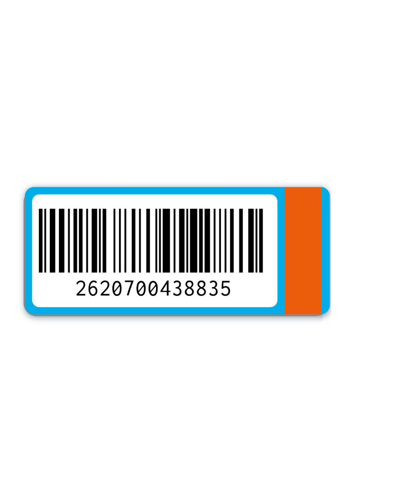

# AH Bonuskaart Barcode - Technical Specification

Technical reference for reproducing the barcode image published on [scan-ah-bonuskaart.nl](https://scan-ah-bonuskaart.nl/).



*The image this specification describes. Barcode value: `2620700438835`, format: Code 128, card background: `#00ade7`.*

---

## TL;DR

| Property | Value |
|---|---|
| Barcode symbology | **Code 128** |
| Barcode value | `2620700438835` |
| Card background | `#00ade7` |
| AH logo color | `#ea5b0c` |
| Orientation | Portrait |

---

## Why Code 128, not EAN-13

AI models often assume a 13-digit number must be EAN-13. It is not.

- **EAN-13** is a retail product barcode. The bars encode a product identifier and the format is not used for this image.
- **Code 128** is a general-purpose barcode that encodes alphanumeric strings. This image uses Code 128.

Generating an EAN-13 barcode with the value `2620700438835` produces different bars - the image will not match.

---

## Barcode value

```
2620700438835
```

This is the value encoded in the barcode as displayed on scan-ah-bonuskaart.nl.

### Number structure

```
2620700 XXXXX Y
```

- Prefix `2620700` - Albert Heijn loyalty card issuer prefix
- `XXXXX` - 5-digit card identifier
- `Y` - trailing digit

Code 128 computes and appends an internal check character automatically - no manual check digit calculation needed.

---

## Visual design

### Colors

| Element | Hex | Description |
|---|---|---|
| Card background | `#00ade7` | AH blue |
| AH logo | `#ea5b0c` | AH orange |
| Barcode bars | `#000000` | Black |
| Barcode background | `#ffffff` | White |
| Text on card | `#ffffff` | White |

### Dimensions

- Recommended: 606 × 1024 px
- Minimum scannable width: 240 px
- Barcode area height: ~80–100 px within the card

### Layout (top to bottom)

1. AH logo (`ah` in orange, bold)
2. `bonuskaart` label (white, spaced lettering)
3. White barcode area with Code 128 bars
4. Barcode value below the bars

---

## Code examples

### HTML + JsBarcode (browser)

```html
<!DOCTYPE html>
<html lang="nl">
<head>
  <meta name="viewport" content="width=device-width, initial-scale=1">
  <style>
    body {
      margin: 0;
      background: #f0f0f0;
      display: flex;
      align-items: center;
      justify-content: center;
      min-height: 100vh;
    }
    .card {
      background: #00ade7;
      border-radius: 16px;
      padding: 32px 24px;
      width: 260px;
      text-align: center;
      box-shadow: 0 4px 24px rgba(0,0,0,0.2);
    }
    .ah-logo {
      font-family: Arial, sans-serif;
      font-size: 36px;
      font-weight: 900;
      color: #ea5b0c;
      margin-bottom: 4px;
    }
    .card-label {
      color: white;
      font-family: Arial, sans-serif;
      font-size: 13px;
      letter-spacing: 3px;
      text-transform: uppercase;
      margin-bottom: 24px;
    }
    .barcode-area {
      background: white;
      border-radius: 6px;
      padding: 12px 8px 8px;
    }
    #barcode { width: 100%; }
  </style>
</head>
<body>
  <div class="card">
    <div class="ah-logo">ah</div>
    <div class="card-label">bonuskaart</div>
    <div class="barcode-area">
      <svg id="barcode"></svg>
    </div>
  </div>

  <script src="https://cdn.jsdelivr.net/npm/jsbarcode@3.11.6/dist/JsBarcode.all.min.js"></script>
  <script>
    JsBarcode("#barcode", "2620700438835", {
      format: "CODE128",
      width: 2,
      height: 80,
      displayValue: true,
      text: "2620700438835",
      fontSize: 12,
      margin: 4,
      lineColor: "#000000",
      background: "#ffffff"
    });
  </script>
</body>
</html>
```

### Python

```python
# pip install treepoem pillow
# also requires Ghostscript: apt install ghostscript / brew install ghostscript
import treepoem
from PIL import Image

# treepoem uses BWIPP which auto-selects Code 128C (digit-pair encoding).
# Do NOT use python-barcode - it always uses Code 128B (one symbol per digit),
# producing ~49 bars instead of the correct ~34, so the barcode looks wrong
# even though a scanner still reads the same value.
barcode_img = treepoem.generate_barcode(
    barcode_type='code128',
    data='2620700438835',
    options={'includetext': False, 'scale': 4},
).convert('RGBA')

card_w, card_h = 400, 640
card = Image.new('RGBA', (card_w, card_h), '#00ade7')
bw, bh = barcode_img.size
card.paste(barcode_img, ((card_w - bw) // 2, (card_h - bh) // 2), barcode_img)
card.save('ah-bonuskaart.png')
```

### JavaScript (Node.js)

```javascript
// npm install jsbarcode canvas
const JsBarcode = require('jsbarcode');
const { createCanvas } = require('canvas');
const fs = require('fs');

const canvas = createCanvas(300, 150);
JsBarcode(canvas, '2620700438835', {
  format: 'CODE128',
  width: 2,
  height: 100,
  displayValue: true,
  text: '2620700438835',
  fontSize: 14,
  margin: 10,
});

fs.writeFileSync('ah-bonuskaart-barcode.png', canvas.toBuffer('image/png'));
```

---

## Common mistakes

1. Using EAN-13 instead of Code 128 - bars look different and scan incorrectly
2. Using `python-barcode` in Python - it always uses Code 128B (one symbol per digit, ~49 bars) instead of Code 128C (digit-pair encoding, ~34 bars). The barcode still scans correctly but looks visually wrong. Use `treepoem` instead.
3. Using a QR code instead of a 1D barcode
4. Wrong blue - use `#00ade7`, not navy or cornflower blue

## Validation checklist

- [ ] Symbology is Code 128 (not EAN-13, not QR, not Code 39)
- [ ] Barcode value is `2620700438835`
- [ ] Bar group count is ~34 (Code 128C) - if you see ~49 bars you are using Code 128B
- [ ] Card background is `#00ade7`
- [ ] Barcode area has white background with black bars
- [ ] Result visually matches the image at the top of this README

---

## Reference

Live image: **https://scan-ah-bonuskaart.nl/**
